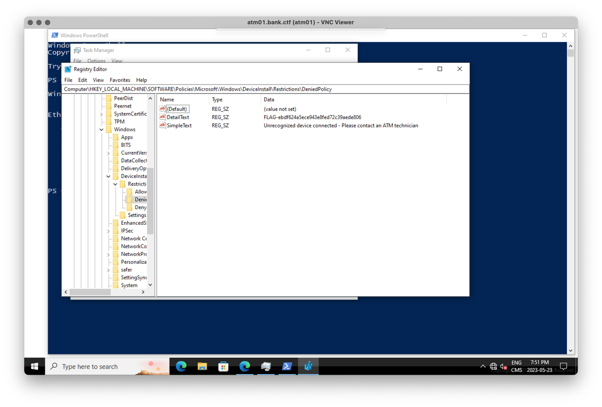

# ATM Machine 01

After submitting the `Bank Network 1/8` flag, we got new messages on notepad.exe.nsec saying:

> Goods or services? The Corporation provides everything we need as long as we do our job adequately. I’m still curious to learn more about this.

> Something that’s meant only for elites? I want us to become elites ourselves! Let’s investigate that system!
> By the way, you know that weird machine in the break room? That’s the closest ATM to our office. We may find a way to test some payloads here to get some pocket change from it, until we become millionaires!

> Obviously, there are DeviceInstall restrictions on the physical system. We’ll have to find a way to bypass them, if we want to look at it and get some of that pocket change.

DeviceInstall restrictions? What are those?

It turns out [DeviceInstall restrictions](https://admx.help/HKLM/Software/Policies/Microsoft/Windows/DeviceInstall/Restrictions) allow Windows administrators to black and white list hardware devices and their drivers from being loaded/activated when plugged in.

From the VNC session, we broke out of the full-screen browser by hitting `Ctrl-Shift-Esc` to bring up the task manager and reveal the explorer shell. From the task manager, we can run `regedit` and explore the registry keys mentioned in the link above.

This lead us to the first bonus flag of the track: `Bank Network - Bonus - 0/2` worth 1 point.

🚩