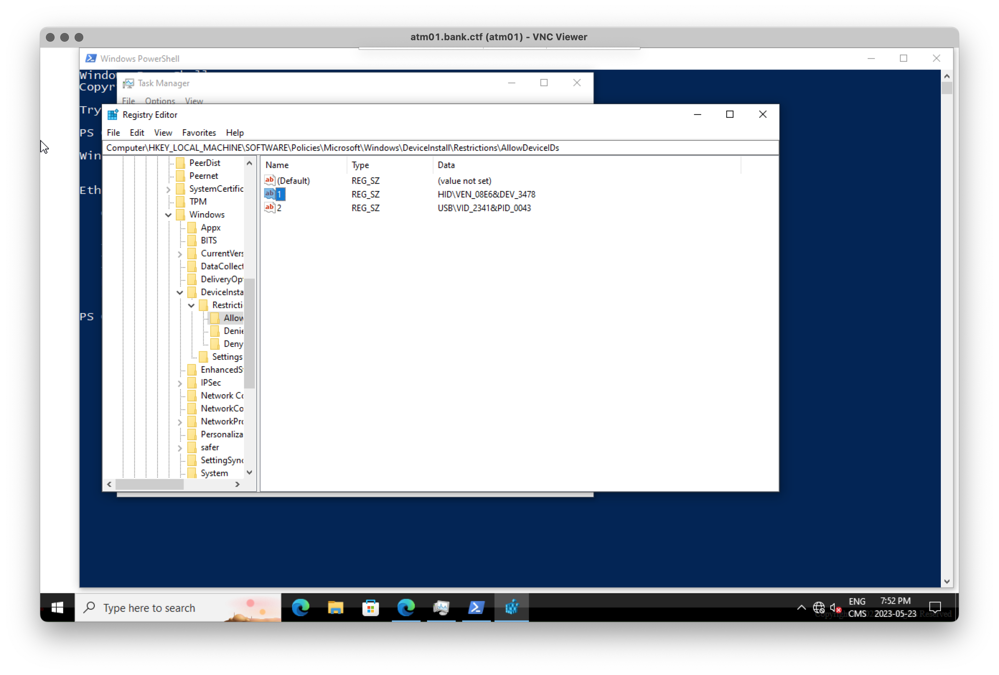
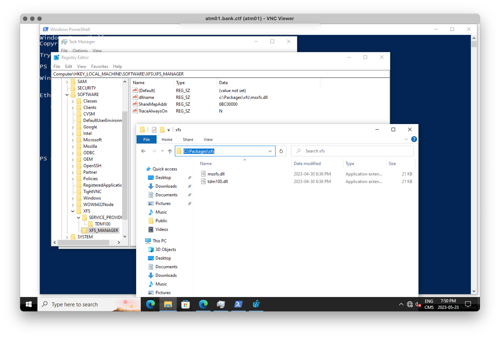
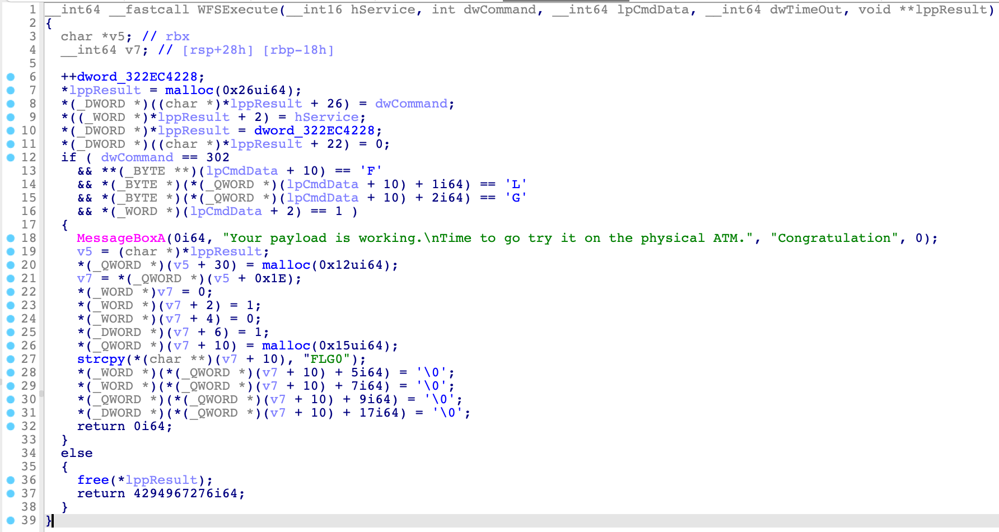
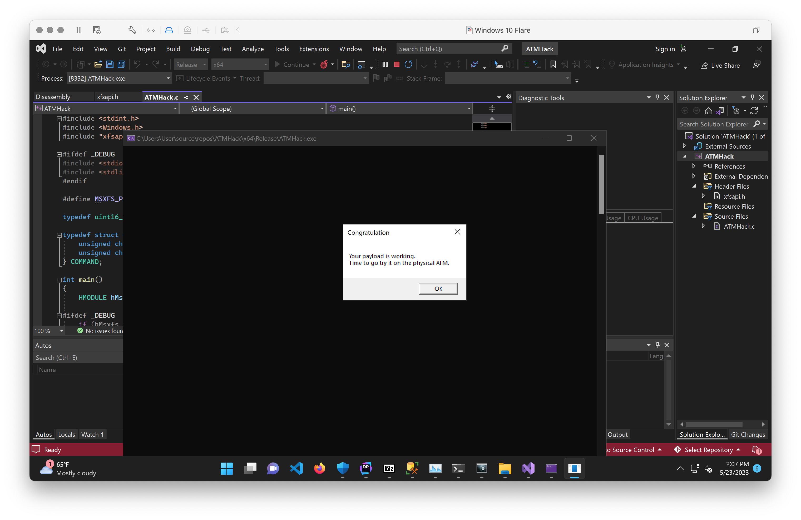
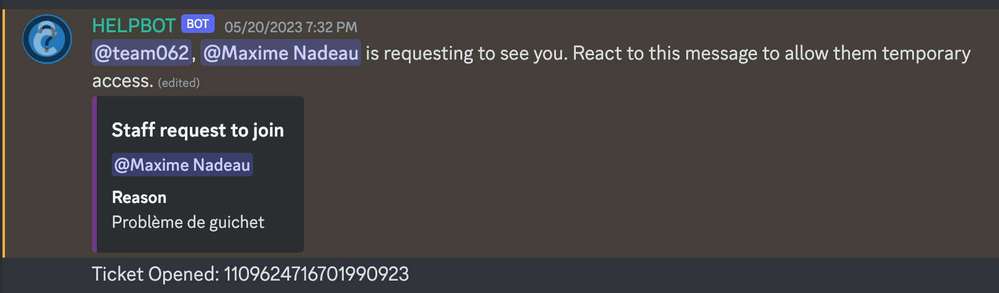

# ATM Machine 02

After submitting the `Bank Network - Bonus - 0/2` flag, we did some more recon on the machine.

First, we discovered the DeviceInstall policies whitelisting only two removable devices:

| `VID:PID` | Name |
|-----------|------|
|08e6:3478  |Gemalto PinPad Smart Card Reader|
|2341:0043  |Arduino SA Uno R3|

We are unsure what the purpose of whitelisting the Arduino was here but we did not focus our attention on it since it was simply a `USB` device. The PinPad was far more interesting to us since it is a `HID` device and this kind of removable device would be able to control the ATM.

Upon physical inspection, the ATM contained an exposed USB port. Our bag of hardware for the team included a DigiSpark Rev3 microcontroller based on the ATTiny85. We put 2 and 2 together and realized we needed to turn this microcontroller into a "Rubber Ducky" type of device: a usb stick that spoofs a keyboard/mouse and does whatever we want to the target system (like break out of the kiosk and p0wn the ATM!!!).

But first, we needed to figure out what exactly "p0wn the ATM!!!" was even going to look like. Further forensics investigation over the VNC connection revealed a bunch of user-added files and folders in `C:\Packages`. Of interest was the folder `C:\Packages\xfs` which contained two identical DLL files: `msxfs.dll` and `tdm100.dll`.

After popping `msxfs.dll` into IDA and googling some exposed function names, it was revealed that we were dealing with [CEN/XFS](https://en.wikipedia.org/wiki/CEN/XFS), also known as "eXtensions for Financial Services".

> CEN/XFS or XFS (extensions for financial services) provides a client-server architecture for financial applications on the Microsoft Windows platform, especially peripheral devices such as EFTPOS terminals and ATMs which are unique to the financial industry.

Googling the function names also led us right to the massive 158-page [PDF](https://www.cencenelec.eu/media/CEN-CENELEC/AreasOfWork/CEN%20sectors/Digital%20Society/CWA%20Download%20Area/XFS/16926-1.pdf) describing the C/C++ API specification.

A cursory search for strings in the binary combined with the PDF told us the complete story we needed to know.

We were going to need to call `WFSExecute` with `dwCommand` set to `302` and the string `FLG` at an offset in the `CmdData` struct.

Following a deep dive into Windows programming full of `Windows.h` data types, we came up with a nice and shiny `12KB` triggering this message box:

The source code for the hack can be found in the `ATMHack` directory.

Essentially, what this code does is that is calls the XFS APIs to tell the Cash Dispenser to dispense some `FLG` currency, therefore Jackpotting the ATM!

## Getting the exploit onto the ATM

We only had half the problem solved now. We still needed this to be running on the ATM itself. We had to get our rubber ducky going.

Fortunately, googling "digispark rubber ducky" led us right to [this WonderHowTo article](https://null-byte.wonderhowto.com/how-to/hack-macos-with-digispark-ducky-script-payloads-0198555/) describing not only how to turn the DigiSpark into a rubber ducky, but also how to change the USB vendor and product ID its HID device would present itself as. Just what we needed to bypass the windows DeviceInstall restrictions on the ATM!

We adjusted the right values in the digistump SDK to make our device identify itself as, you guessed it, a `08e6:3478 Gemalto PinPad Smart Card Reader`. Except it was actually an evil keyboard intended to hack the ATM.

We then wrote a basic payload that would open the task manager, start a powershell instance, type out the payload as a base64 string and decode it into a payload on disk, and then run the payload. 

Everything was going well until we hit the first obstacle in what was going to become a series of brick walls.

The program refused to flash on the controller because, if you recall, we had a `12KB` executable, but the controller is so shitty that it only has `8KB` of memory in TOTAL. We tried zipping the binary and the lowest we could get down to was `8KB`, which was too big for the payload + program in the controller memory. It was time to go back to the drawing board.

We spent way too much time finding every MSVC compiler and linker option we could use to reduce the size of the binary. That still wasn't enough. Until we managed to get the binary to compile without linking to the `msvcrt` standard library. That got our binary down to only `3KB` uncompressed and `1KB` zipped! Wow! We went with a ZIP compressed binary due to PowerShell having a function to expand ZIP archives.

We flashed this new payload onto the microcontroller and it only used up 70% of the available space along with the program. We were _SO_ ready to jackpot the ATM.

We walked up to it, plugged in the stick and watched it do its thing. But then something totally unexpected happened. The task manager opened but then the ducky was no longer opening PowerShell. Sometimes it would manager but it would just start printing random gibberish of Base64 totally out of order. We had no idea what was going on.

It once again took us way too long to realize that that microcontroller is just way shittier than we were even prepared to imagine. Even though our program and the payload could fit into its memory, filling the memory up too much would just cause it to spaz out.

We were getting agitated by this point and running out of options, so we went for the drastic solution: splitting the payload into stages.

The code for the Digispark controller can be found in the `Digispark` folder.

The physical ATM's kiosk application and interface would reset itself every 2 minutes, so we only had 2 minutes to perform the hack. Typing out the payload from the ducky takes time. We ended up devising a 2-person workflow where 1 person would be queuing up the payload stage flashing in Arduino IDE on the laptop while the other one would transfer the microcontroller back and forth between the ATM and the laptop. It went something like:

1. Plug the microcontroller into the laptop
2. Flash part 1 of the payload onto the microcontroller
3. Unplug the microcontroller from the laptop and plug it into the ATM
4. Start preparing the flash job for part 2 of the payload on the laptop while the microcontroller is executing its payload
5. Unplug the microcontroller from the ATM and plug it into the laptop to flash part 2 of the payload
6. Repeat this process n times for n parts of the payload... you get the point.
7. ???
8. PROFIT

This whole workflow is what made our hack so epic and suspenseful, getting it described as "straight out of a movie" by event organizers who were watching us iterate on the process.

We were (once again) _SO_ ready to jackpot the ATM.

We walked up to it, plugged in the stick and watched it do its thing while doing our movie-esque hacking dance. But then something totally unexpected happened. The payload was successfully delivered and ran. But nothing happened. No message box popped up, no cash came flying out. Something was very wrong, and this was the exact code that worked on the fake ATM via VNC.

Out of ideas, we reached out to the challenge designer for help and went out for supper while we waited for a response.

Eventually, help was on the way. The challenge designer wanted to meet us and see what happened.

We showed him our exploit and he immediately spotted the issue. It turns out the code path used to show message box on the ATM VM saying the hack is successful was not the same as the one on the real ATM. The message box was misleading and he apologized. We actually had an idea of what the issue could be and he confirmed to us that we were on the right path.

`WFSExecute` requires an `HSERVICE` (handle to the `WFS` "service") to be passed to it to operate on. Since the message box trigger condition in the VM didn't even check for a valid handle, we took a shortcut and didn't bother acquiring a handle and just passed `NULL`, crashing the program on the real ATM.

We then refactored the hack to acquire a handle via `WFSOpen` and passed it to `WFSExecute`. We were still getting a message box.

We were (once again) _SO_ ready to jackpot the ATM.

We walked up to it, plugged in the stick and watched it do its thing while doing our movie-esque hacking dance. But then something totally unexpected happened **AGAIN**.

I think a pattern is starting to emerge here...

A message popped up in powershell saying that our hack was not a valid Win32 executable... **What?!** We stepped aside and looked over everything once again. We couldn't find anything wrong with our code and concluded that we may have made a mistake flashing payloads and executed the same payload twice, leading to valid base64 being decoded for the zip archive, but invalid archive contents being spit out on disk. We were just going to try again.

We were (once again) _**SO**_ ready to jackpot the ATM.

We walked up to it, plugged in the stick and watched it do its thing while doing our movie-esque hacking dance. One of the steps failed to flash in the middle of the hack. We wasn't going to let that happen to us right now. The laptop operator started swearing and then the ATM operator ripped the controller out of the laptop and plugged it right back in. It flashed this time and didn't disrupt the hack in the heat of the moment. We watched as the final steps were being run in the PowerShell window (mostly obscured by the task manager).

And then it fucking _**HAPPENED**_!

Money came flying out the ATM cash slot and the audience was cheering!

Watch the video of the excitement [here](https://twitter.com/eltdude/status/1660774864901361664)!

The last step involved placing the bills under a UV light to reveal the flag.

This lead us to the last bonus flag of the track: `Bank Network - Bonus - 2/2` worth 8 points.

🚩