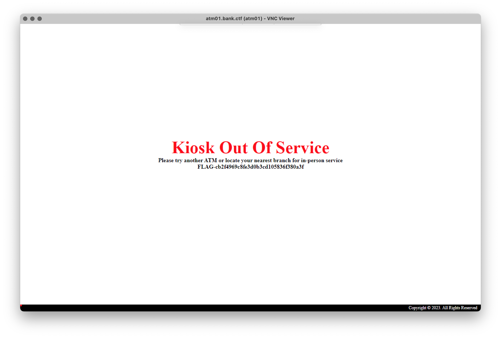

# ATM Network 01

We get a message on notepad.exe.nsec saying:

> Found an unusual system in the logs: atm01.bank.ctf
> Seems connected to www.bank.ctf - Should investigate.
> 
> WTH is an ATM?

We then nmap atm01.bank.ctf:
```console
root@ctn-shell:~# nmap -6 -Pn atm01.bank.ctf
Starting Nmap 7.80 ( https://nmap.org ) at 2023-05-23 19:45 UTC
Nmap scan report for 9000:c1f3:fea4:dec1:216:3eff:fe13:ef28
Host is up (0.0011s latency).
Not shown: 997 filtered ports
PORT     STATE SERVICE
135/tcp  open  msrpc
445/tcp  open  microsoft-ds
5900/tcp open  vnc

Nmap done: 1 IP address (1 host up) scanned in 4.83 seconds
```

An exposed VNC server! Let's connect and find out what awaits us on the other side.



We got the first flag of the track: `Bank Network 1/8` worth 1 point.

🚩